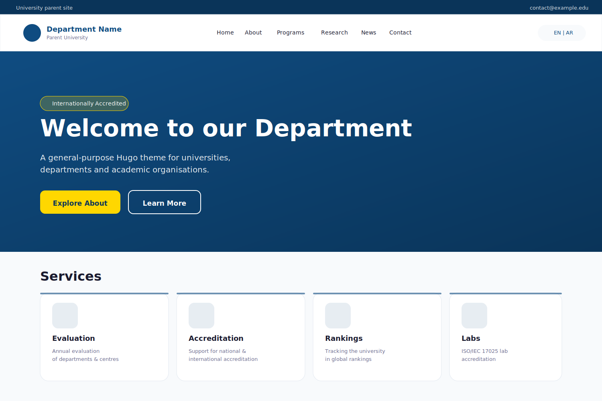

# qaduni-theme

A general-purpose, bilingual (RTL/LTR-ready) Hugo theme for universities,
academic departments, faculties, research centers and similar public-sector
organisations. Originally built for Al-Qadisiyah University.



## Features

- **Menu-driven navigation** — every nav surface (header, footer, quick links,
  homepage service cards, hero CTAs) reads from Hugo's `Site.Menus` so you
  reshape the IA from `hugo.toml`, not by editing templates.
- **Multilingual + RTL** — works out-of-the-box with any number of languages;
  RTL is selected from the language's `direction` config, not a hardcoded
  language code, so Arabic, Hebrew, Urdu and Persian all "just work".
- **Configurable branding** — set one CSS-variable-friendly hex value in
  `Site.Params.theme.primaryColor` and the entire UI re-skins (CSS, PWA
  `theme_color`, `<meta name="theme-color">`).
- **Self-hosted fonts** — Cairo + Inter shipped under `static/fonts/`,
  preloaded per-language. Override the font stack via the
  `--font-arabic` / `--font-english` CSS variables.
- **Hugo Pipes asset pipeline** — CSS concatenated, minified, fingerprinted;
  JS minified, fingerprinted; image processing for PWA icons.
- **PWA-ready** — `index.webmanifest` is param-driven; optional service
  worker registration is gated on `Site.Params.pwa.enabled`.
- **SEO scaffolding** — JSON-LD (`Organization` / `EducationalOrganization`
  / etc., all param-driven), Open Graph, Twitter cards, hreflang.
- **Optional Pagefind integration** — wires the official Pagefind component
  UI into the news/announcements list page when
  `Site.Params.search.pagefind = true`.
- **Data-driven forms** — contact + graduate-survey shortcodes read their
  option lists from `data/contactForm.yaml` / `data/graduateForm.yaml`.

## Hugo version

Requires **Hugo ≥ 0.124.0** (uses per-language `locale` for ICU date
formatting and `merge` / `dict` template features).

## Installation

### As a Git submodule

```sh
cd your-site
git submodule add https://github.com/qaduni/qu.theme themes/qu.theme
```

Then in your `hugo.toml`:

```toml
theme = "qaduni-theme"
```

### As a Hugo Module

```sh
cd your-site
hugo mod init github.com/you/your-site
```

Then in `hugo.toml`:

```toml
[module]
  [[module.imports]]
    path = "github.com/qaduni/qu.theme"
```

## Minimal site config

The theme works with no params at all (sensible defaults shipped). A small
set of params unlocks every brand and identity surface — see
`exampleSite/hugo.toml` for the full schema. A starter:

```toml
baseURL = "https://your-site.example/"
defaultContentLanguage = "en"
title = "Your Organisation"
theme = "qaduni-theme"

[languages]
  [languages.en]
    title  = "Your Organisation"
    locale = "en"
    direction = "ltr"
    [languages.en.params]
      description = "What you do, in one sentence."
      shortTitle  = "Short Name"
      parentName  = "Parent Organisation"  # shown under the main title
      [languages.en.params.contact]
        address = "123 Main Street, City"

[params]
  [params.contact]
    email = "info@your-site.example"
    phone = "+1 555 0100"
  [params.theme]
    primaryColor      = "#0f4c81"
    primaryColorLight = "#1a6bb5"
    primaryColorDark  = "#0a3459"
    accentColor       = "#ffd700"
```

## Menus

Every navigation surface is menu-driven. Define menus in
`config/_default/menus.<LANG>.toml`. The theme reads these menu identifiers:

| Identifier          | Used where                                          |
| ------------------- | --------------------------------------------------- |
| `main`              | Top-level header navigation (supports nesting)      |
| `top_bar`           | Skinny bar above the main header                    |
| `footer_useful`     | Left footer column                                  |
| `footer_services`   | Middle footer column                                |
| `footer_bottom`     | Footer copyright row                                |
| `quick_links`       | Homepage "Quick Links" grid                         |
| `homepage_services` | Homepage 4-card "Services" section                  |
| `hero_buttons`      | Hero CTA buttons (2 entries recommended)            |

Per-entry params the theme reads:

- `.Params.icon` — name of an SVG sprite symbol (`#icon-document`,
  `#icon-award`, `#icon-globe`, `#icon-research`, `#icon-users`,
  `#icon-book`, `#icon-email`, `#icon-building`, ...). Defined in
  `layouts/partials/icons.html`.
- `.Params.external` — `true` to open in a new tab with `rel="noopener"`.
- `.Params.description` — body text for `homepage_services` cards.
- `.Params.style` — `accent`, `primary`, `secondary` for `hero_buttons`.

## Content types

The theme renders any section, but two are special:

- **News** — default section path `/news`. Override at
  `Site.Params.contentSections.news`. The homepage strip + the
  combined news/announcements list page read from this path.
- **Announcements** — default section path `/announcements`. Pages here
  get the "Announcement" badge instead of "News"; mark front matter
  `important: true` to surface a high-priority indicator.

Per-page front matter the theme reads:

- `image` / `imageAlt` — card cover image and alt text.
- `type` — category for announcements (`administrative`, `academic`,
  `students`, `general` — extend with new `category_<name>` i18n keys).
- `important` — boolean; highlights the card and adds an "Important" badge.
- `icon` — sprite name shown on `_default/section.html` card grids.

## Branding & customisation

Override CSS variables from your own stylesheet OR set
`Site.Params.theme.<color>` in `hugo.toml`. The theme renders a `<style>:root`
block server-side with your values, which cascade through every component.

The brand-coloured translucent overlays use `rgba(var(--color-primary-rgb), X)`
so a single param change re-tints headers, dropdowns, badges, the hero
overlay and shadows.

To swap fonts: override `--font-arabic` and `--font-english`, then add
your woff2 files under `assets/fonts/` (or `static/fonts/`) and update
`Site.Params.theme.preloadFonts.<lang>` to point at the new filenames.

## i18n

Translation bundles ship in `i18n/{en,ar}.yaml`. Override any key by
placing the same key in your site's `i18n/<lang>.yaml`; Hugo merges
site over theme automatically. Add languages by creating new bundle
files and matching `[languages.<code>]` entries in `hugo.toml`.

## Pagefind (optional search)

To enable site-wide news/announcement search:

1. `npm i -g pagefind` (or use `npx`)
2. Build the site: `hugo --minify`
3. Run pagefind against the build: `pagefind --site public`
4. Set `Site.Params.search.pagefind = true`

The theme then includes the Pagefind component UI on the
news-list page and emits the data-pagefind metadata on single articles.

## Browser support

Modern evergreen browsers. CSS uses `var()`, `:focus-visible`, logical
properties (`margin-inline`, `padding-inline-*`) and `aspect-ratio`. No
build step required.

## Accessibility notes

- All decorative SVGs use `aria-hidden="true"`.
- The mobile menu toggle and language switcher carry `sr-only` labels
  resolved via i18n.
- Focus styles are explicit (`:focus-visible` outlines on form fields).
- Skip-to-main `<main id="main-content">` target is exposed.
- Per-language `dir` and `lang` attributes are set on `<html>`.

## License

[MIT](LICENSE) — use, fork, modify, redistribute. Attribution not required
but appreciated.
